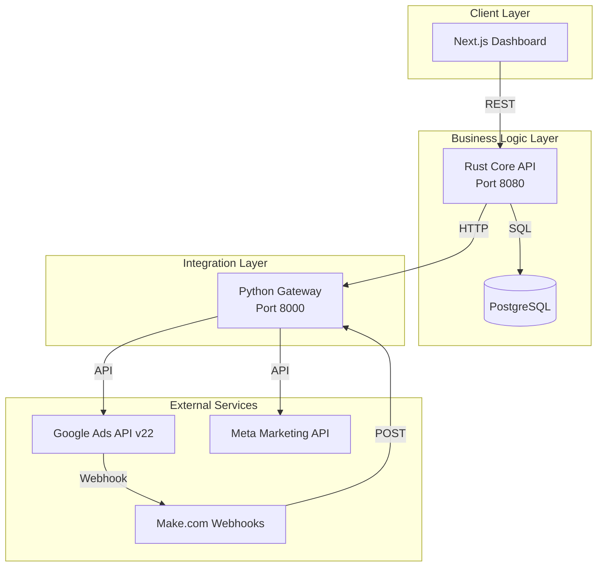

# 🏗️ IBVI Ads Platform - Architecture

## System Overview

The IBVI Ads Platform is designed as a **three-tier architecture** with clear separation of concerns:

1. **Presentation Layer** (Next.js Frontend)
2. **Business Logic Layer** (Rust Core API)
3. **Integration Layer** (Python Gateway)

---

## Component Diagram



---

## Data Flow

### Campaign Retrieval Flow
```
User Request
    ↓
Frontend (Next.js)
    ↓ GET /campaigns
Rust Core API
    ↓ HTTP (parallel)
    ├─→ Python Gateway → Google Ads API
    └─→ Python Gateway → Meta Ads API
    ↓ (aggregate)
Rust Core API
    ↓ JSON response
Frontend (renders unified view)
```

### Conversion Tracking Flow
```
Customer Action (click/purchase)
    ↓
Google Ads (tracks gclid)
    ↓ Conversion Event
Python Gateway
    ↓ POST /v1/conversions/google
Google Ads API (enhanced conversions)
    ↓
Campaign Performance Updated
```

### Lead Form Flow
```
User fills Google Ads Lead Form
    ↓ Webhook trigger
Make.com
    ↓ POST /api/v1/webhooks/zapier
Python Gateway
    ↓ Priority routing
CRM / Notification system
```

---

## Technology Decisions

### Why Rust for Core API?

1. **Performance**: 10x faster than Python for aggregation
2. **Concurrency**: Tokio async runtime handles thousands of requests
3. **Type Safety**: Compile-time guarantees prevent runtime errors
4. **Memory Safety**: No GC pauses, predictable performance

### Why Python for Gateway?

1. **Libraries**: Official Google Ads & Meta Ads SDKs
2. **Rapid Development**: Faster iteration on API integrations
3. **Data Processing**: Pandas for analytics
4. **Ecosystem**: Rich ecosystem for API work

### Why Next.js for Frontend?

1. **SSR/SSG**: Fast initial page loads
2. **React 19**: Modern component model
3. **TypeScript**: Type safety across stack
4. **Vercel Deploy**: Easy deployment

---

## Scalability Strategy

### Horizontal Scaling
```
Load Balancer
    ↓
┌───────┬───────┬───────┐
│Core 1 │Core 2 │Core 3 │  (Rust instances)
└───┬───┴───┬───┴───┬───┘
    └───────┴───────┘
          ↓
┌─────────┬─────────┐
│Gateway 1│Gateway 2│  (Python instances)
└─────────┴─────────┘
```

### Caching Strategy
- **Redis**: Campaign data (5min TTL)
- **In-memory**: Keyword mappings
- **CDN**: Static assets

---

## Security Architecture

### Authentication Flow
```
User
  ↓ JWT token
Frontend
  ↓ Authorization: Bearer <token>
Rust Core API (validates JWT)
  ↓ Service-to-service token
Python Gateway
  ↓ OAuth2 tokens
External APIs
```

### Secret Management
- **`.env` files**: Local development
- **Fly.io Secrets**: Production
- **Google Cloud Secret Manager**: API credentials

---

## Database Schema (PostgreSQL)

```sql
-- Campaigns cache
CREATE TABLE campaigns (
    id UUID PRIMARY KEY,
    platform VARCHAR(10) NOT NULL,  -- 'google' or 'meta'
    external_id VARCHAR(255) NOT NULL,
    name VARCHAR(255),
    status VARCHAR(50),
    budget_micros BIGINT,
    daily_budget_micros BIGINT,
    created_at TIMESTAMP DEFAULT NOW(),
    updated_at TIMESTAMP DEFAULT NOW()
);

-- Optimization runs
CREATE TABLE optimization_runs (
    id UUID PRIMARY KEY,
    campaign_id UUID REFERENCES campaigns(id),
    old_budget_micros BIGINT,
    new_budget_micros BIGINT,
    reason TEXT,
    created_at TIMESTAMP DEFAULT NOW()
);
```

---

## API Contracts

### Core API → Gateway

```rust
// Rust client calling Python gateway
let response = http_client
    .get("http://gateway:8000/v1/google/campaigns")
    .header("X-Service-Auth", service_token)
    .send()
    .await?;
```

### Frontend → Core API

```typescript
// TypeScript client calling Rust core
const campaigns = await fetch('/api/campaigns')
  .then(res => res.json() as Promise<Campaign[]>)
```

---

## Monitoring & Observability

### Metrics Collected
- **Request latency** (p50, p95, p99)
- **Error rates** by endpoint
- **Campaign sync lag**
- **Conversion upload success rate**

### Logging
- **Structured JSON logs** (stdout)
- **Correlation IDs** across services
- **Log aggregation**: Fly.io Logs

### Alerting
- **Budget overspend**: > 110% of daily budget
- **API failures**: > 5% error rate
- **Webhook delays**: > 5min lag

---

## Deployment Architecture

```
┌─────────────────────────────────────┐
│         Fly.io Edge Network         │
└────────────┬────────────────────────┘
             ↓
┌────────────────────────────────────┐
│     Load Balancer (Fly Proxy)      │
└──┬─────────────────────────┬───────┘
   ↓                         ↓
┌──────────┐           ┌──────────┐
│ Core API │           │ Gateway  │
│ (Rust)   │←─────────→│ (Python) │
└──────────┘           └──────────┘
     ↓
┌──────────────┐
│ PostgreSQL   │
│ (Fly Volume) │
└──────────────┘
```

---

## Future Architecture Improvements

1. **Event-Driven Architecture**
   - Add Kafka/Redis Streams
   - Async processing of large batches

2. **GraphQL Layer**
   - Replace REST with GraphQL
   - Reduce over-fetching

3. **Microservices Split**
   - Separate Google Ads service
   - Separate Meta Ads service
   - Dedicated optimization service

4. **Real-time Updates**
   - WebSocket connections
   - Server-Sent Events for live metrics

---

**Last Updated**: 2025-11-17  
**Architecture Version**: 1.0
