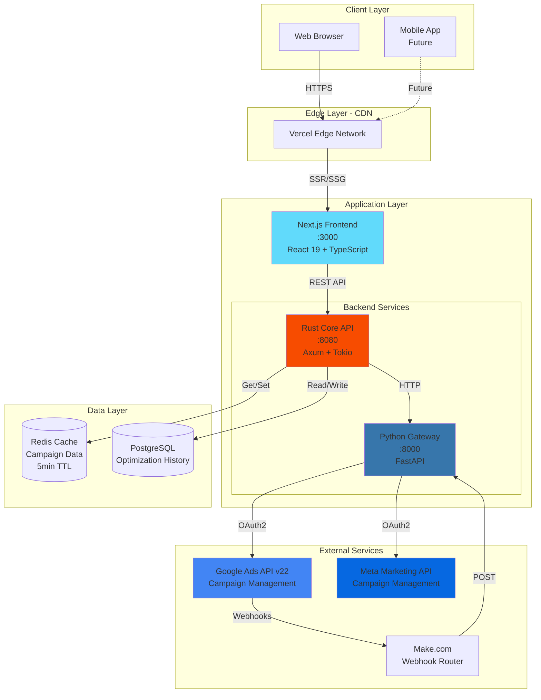
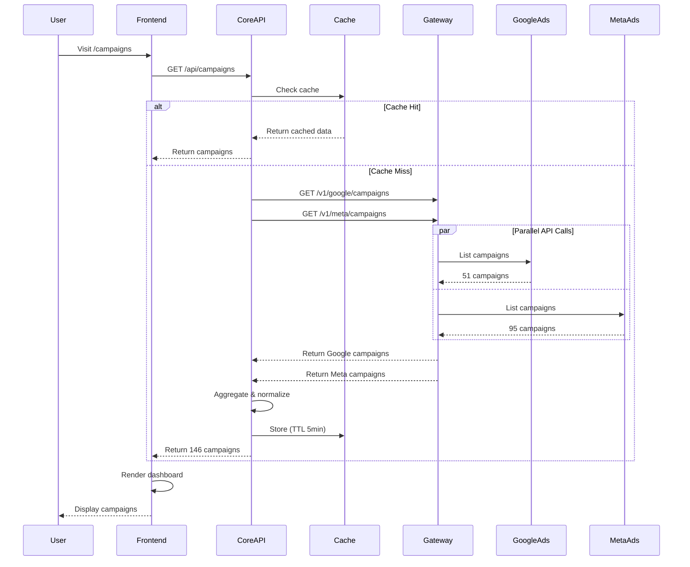
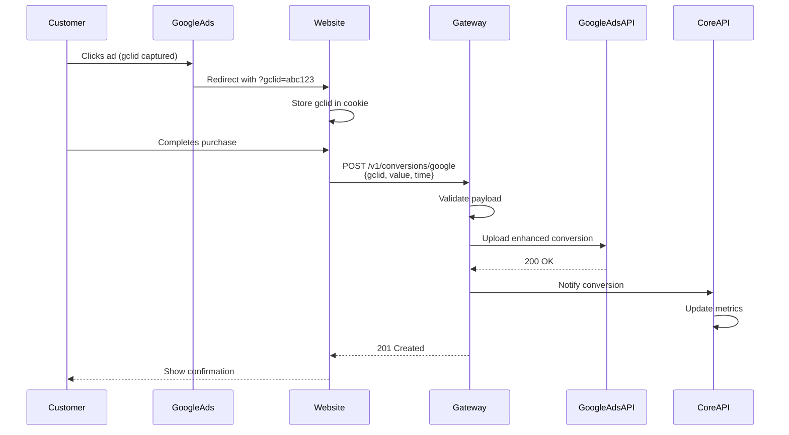
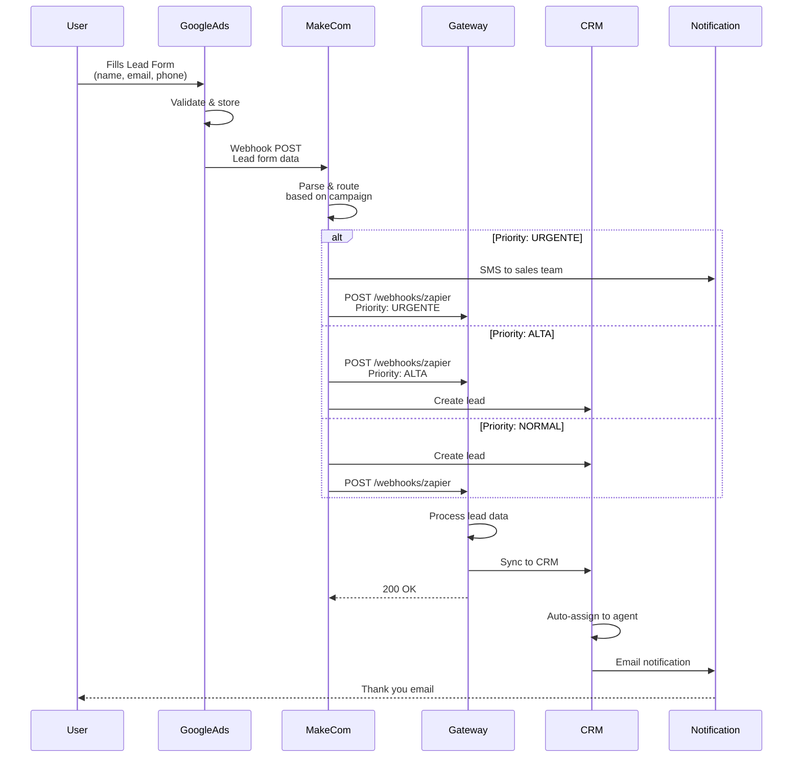
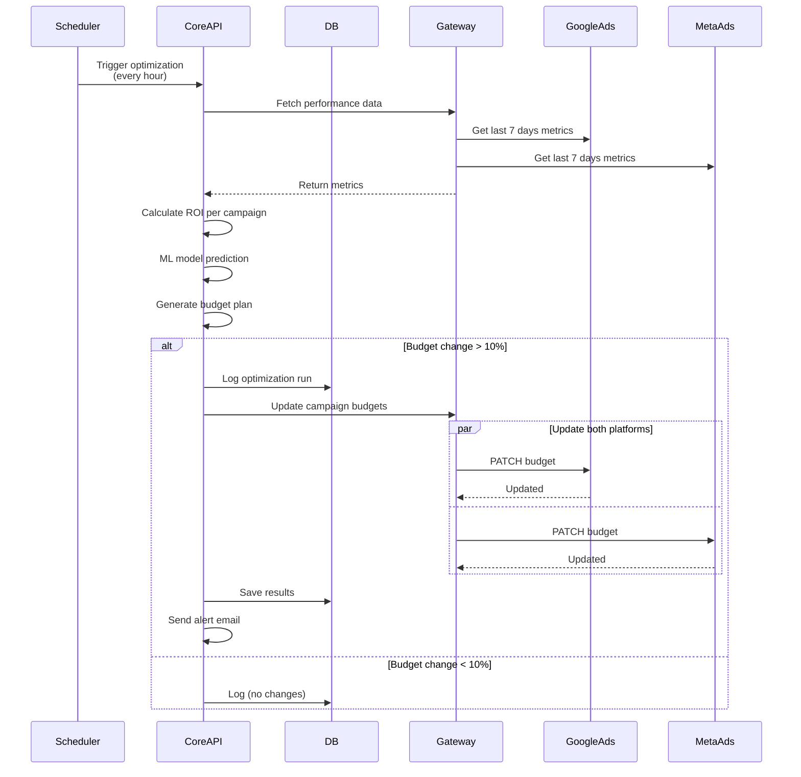
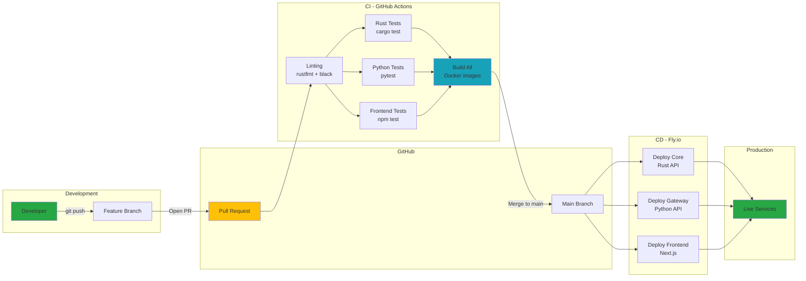
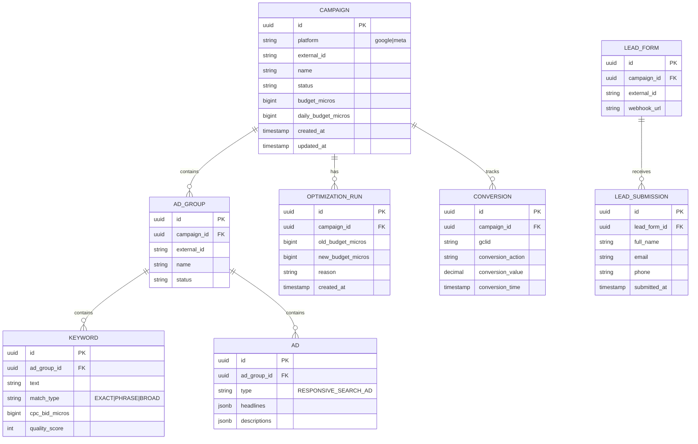
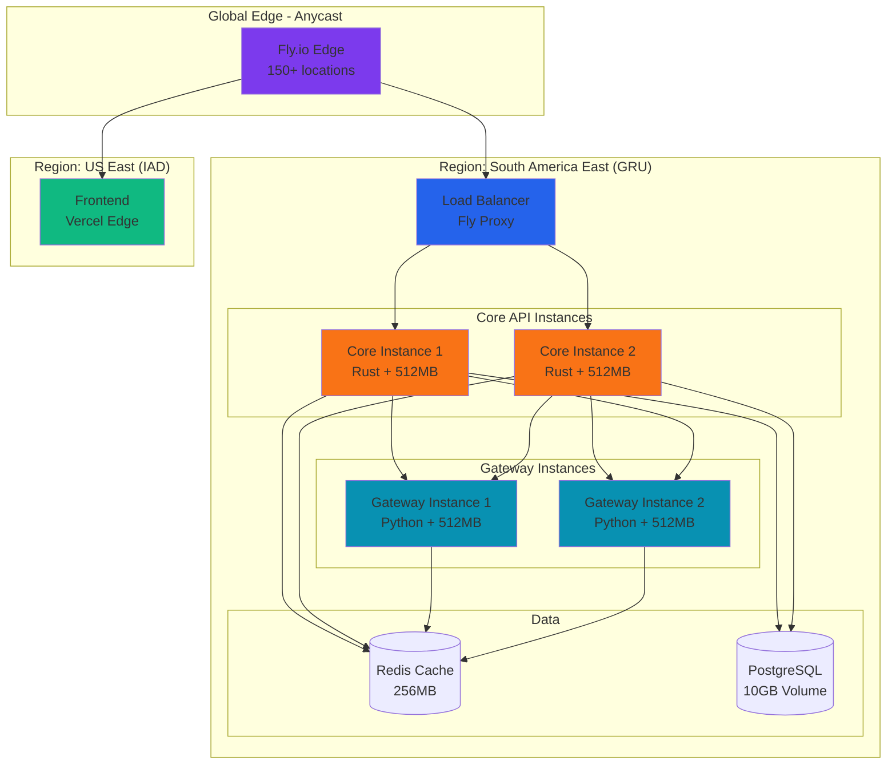

# System Architecture Diagrams

## High-Level System Overview

---

## Request Flow - Campaign Retrieval

---

## Conversion Tracking Flow

---

## Lead Form Webhook Flow

---

## Budget Optimization Flow

---

## Monorepo CI/CD Pipeline

---

## Data Model

---

## Deployment Architecture (Fly.io)

---

**Generated**: 2025-11-17  
**Tool**: Mermaid.js (GitHub native rendering)
